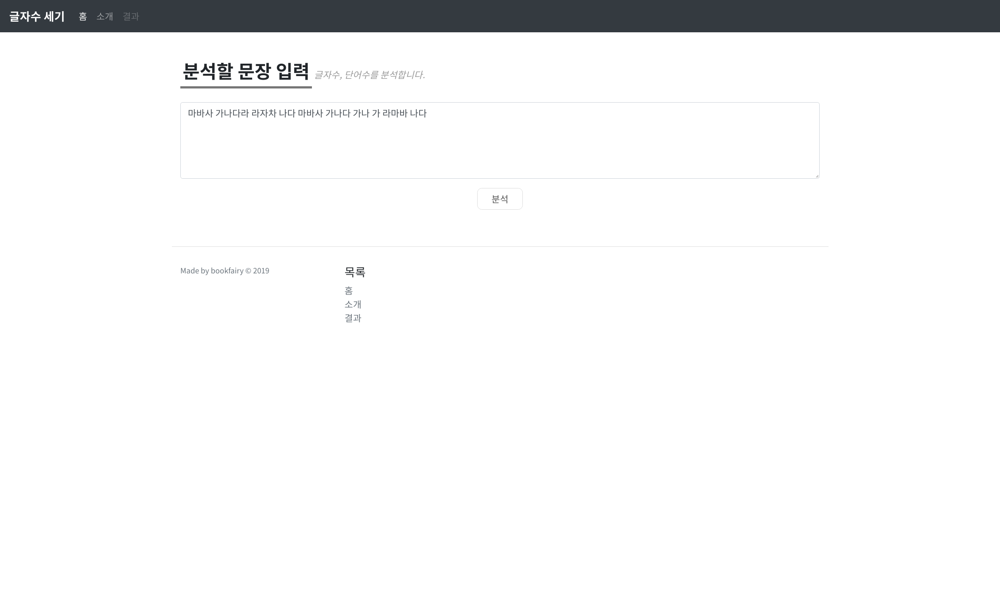
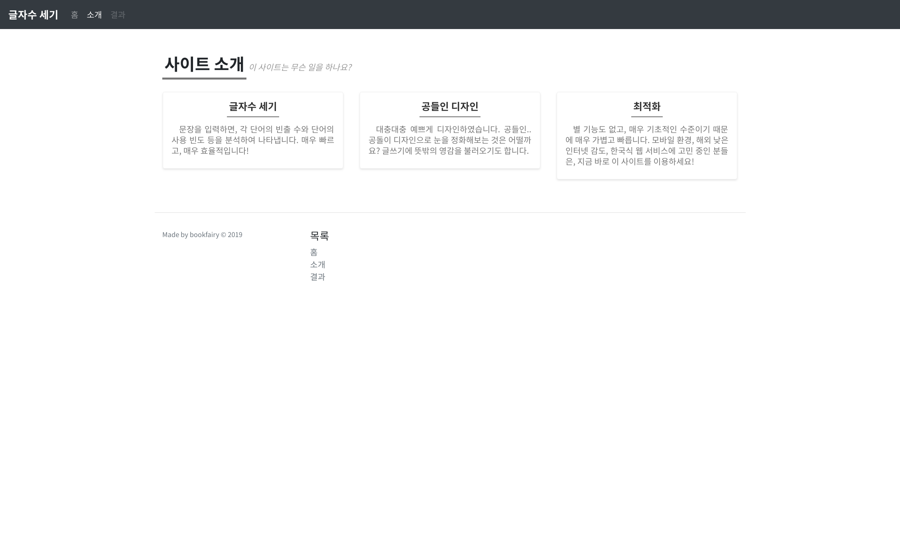
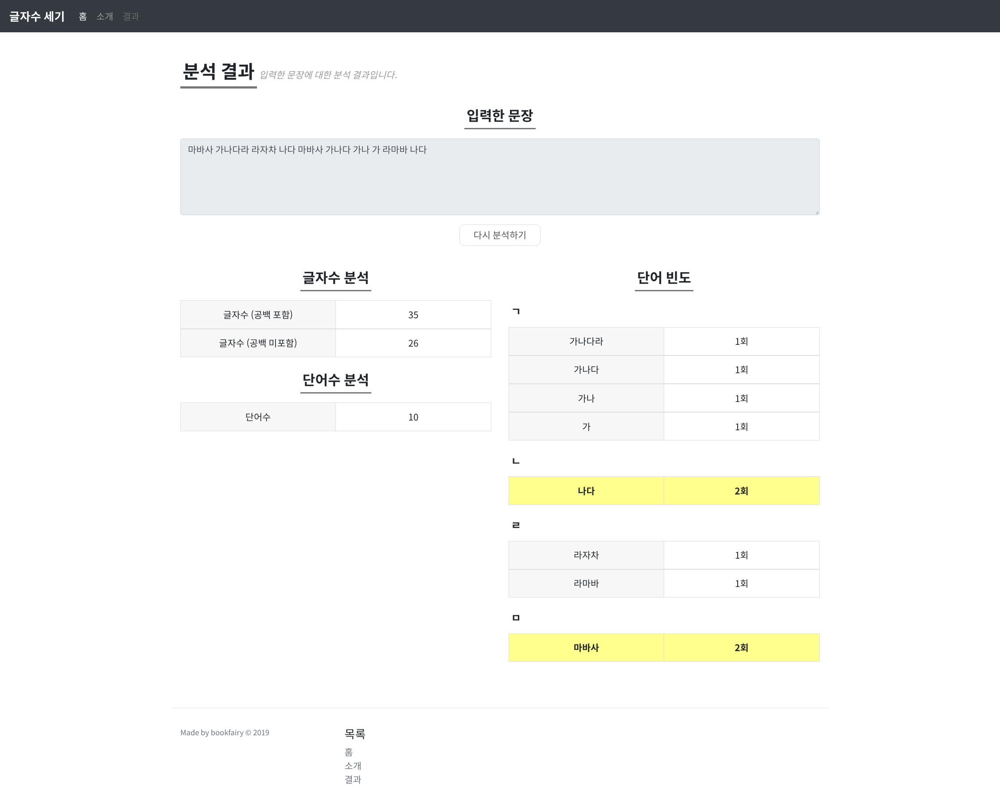
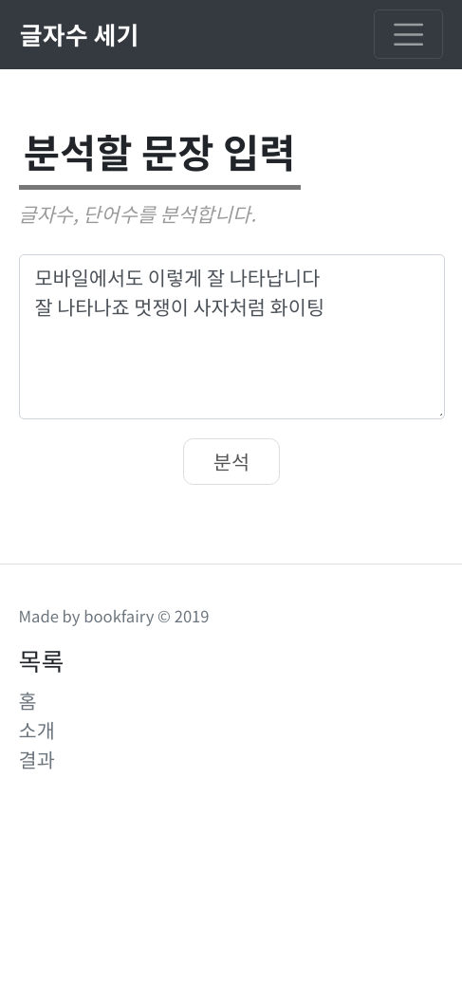
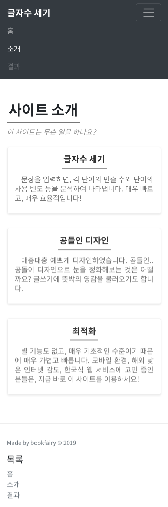
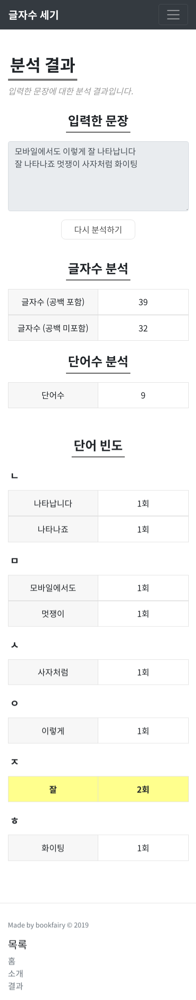

# 글자수 세기
* 멋쟁이 사자처럼 클래스 라이언 과제 1, wordcount
* 본 프로젝트는 기본 프로젝트에서 소소한 발전이 있었습니다.

## 다양한 기능
* 글자수와 단어수를 각각 분석하여 나타냅니다.
* 사용자에게 직관적이고 편안한 디자인을 구현하였습니다.
* 단어 빈도를 통해 각각의 단어에 대한 빈도수를 나타내고, 가장 많이 사용된 단어에는 하이라이트 처리하여 주목할 수 있게 하였습니다.
* hgtk 패키지를 이용하여 단어를 사전순으로 정렬하고, 이를 직관적으로 확인할 수 있게 하였습니다. ('ㄱ', 'ㄴ', ...) 한글과 영어, 기타 다양한 언어들을 모두 지원합니다.

## 디자인
* 디자인이 개선되었습니다.
* Typography 디자인입니다.
* bootstrap과 아주 약간의 js를 이용하여 구현하였습니다.

### PC 스크린샷

### 모바일 스크린샷

* 반응형 디자인으로, 모바일에서도 완벽하게 디자인되어 있습니다.
* 테스트 기기는 iPhone X입니다.

## 기타
* 형태소 분석기도 넣으려 했는데 모든 패키지가 제대로 설치되지 않아 포기하였습니다.
* 특수문자 처리는 귀찮아서 빼먹었습니다. 나중에 구현할 수도 있습니다.

## 개발 환경
* Linux Mint 19.1 Cinnamon
* Google Chrome 71.0.3578.98
* Pycharm Professional 2018.3.3
* Python 3.7.2
* Django 2.1.5
* hgtk 0.1.3
